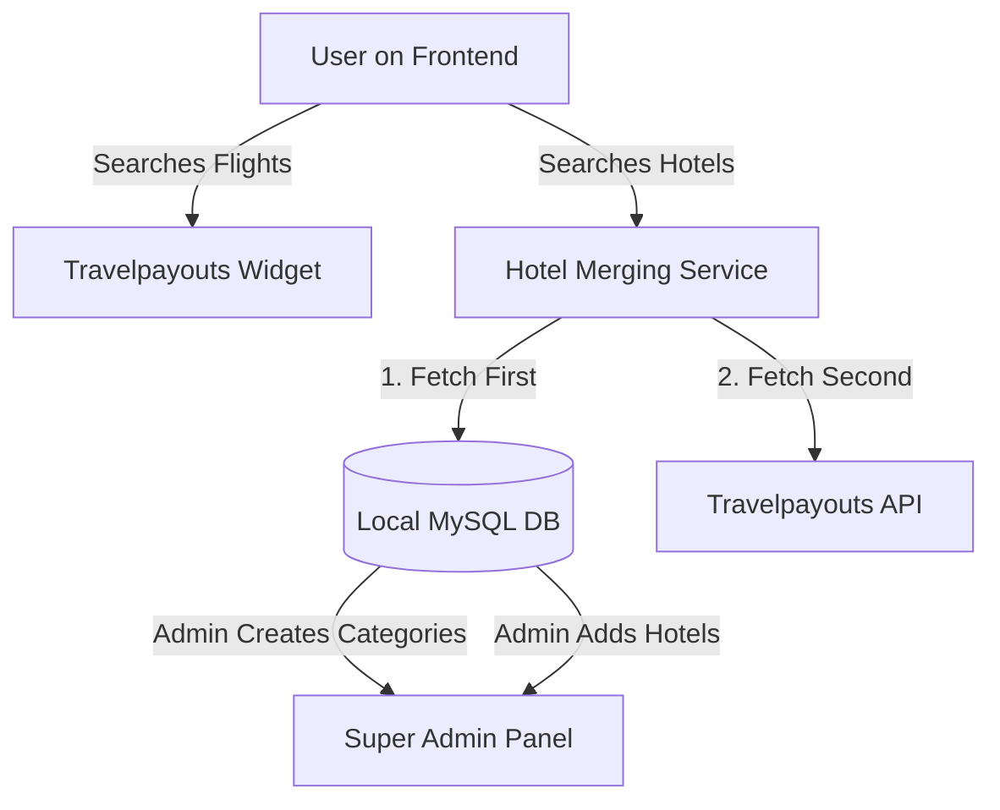

# Core Project Concept: Flights & Hotels

This document outlines the core business logic and data flow for the EasyTrip platform to ensure AI assistants and future developers perfectly understand the system's requirements.

## 1. Flight Searching
- **Data Source**: 100% powered by Travelpayouts.
- **Implementation**: The flight search functionality is integrated via the Travelpayouts embed script/widget.
- **Logic**: No local database management is required for flight inventory. All flight searches, results, and bookings are handled through the Travelpayouts ecosystem.

## 2. Hotel Booking (Hybrid System)
The hotel system is a hybrid model combining local inventory with external affiliate inventory. It must seamlessly merge these two sources on the frontend.

### A. Local Inventory (Super Admin Managed)
- **Categories**: The Super Admin has the ability to create dynamic "Categories" (e.g., Luxury, Budget, Near Airport, etc.).
- **Hotel Management**: The Super Admin manually adds our own hotels and assigns them to these categories.
- **Data Storage**: All local categories, hotels, rooms, and pricing are stored in our local MySQL database.

### B. External Inventory (Travelpayouts)
- **Data Source**: Supplementary hotels fetched via the Travelpayouts API/Widgets.

### C. Display Priority & Merging Logic (CRITICAL)
When a user searches for or views hotels on the frontend:
1. **Priority 1 (Local Hotels)**: The hotels added by the Super Admin from our local database **MUST** always be displayed first at the top of the results.
2. **Priority 2 (Travelpayouts Hotels)**: The external hotels from Travelpayouts will be appended and shown **AFTER** our local hotels.
3. **Seamless UX**: Despite coming from two different sources, the UI must present them as a unified list to the user.

## System Flow Summary

